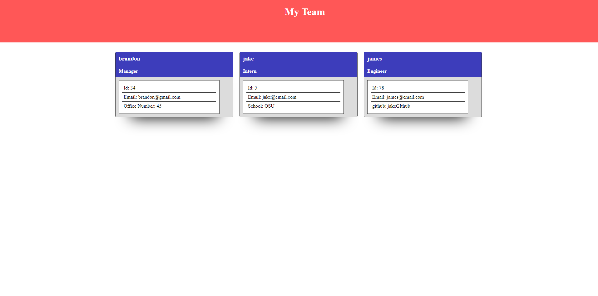

# Team-Profile-Generator

  This project allows users to enter in employees, including managers, engineers and interns via the command line, and generates an html page with contact info for each employee entered.
  
  ## Table of Contents
  
  - [License](#license)
  - [Technologies](#technologies)
  - [Tests](#tests)
  - [Dependencies](#dependencies)
  - [Contributing](#contributing)
  
  ## Screenshots

  
  ## Technologies

    * Inquirer
    * Node.js 
    * Jest
  
  
  ## Tests

    * To run a test, enter npm test
  
  ## Dependencies

    * To install dependencies, enter npm i
  
  ## Contributing

  GitHub: https://github.com/bHutchingson